# Praktikum Modul 2
Hanun Shaka Puspa - 5025211051
Probstat C

## 1. Kadar Saturasi Oksigen
```
Seorang peneliti melakukan penelitian mengenai pengaruh aktivitas 𝐴 terhadap
kadar saturasi oksigen pada manusia. Peneliti tersebut mengambil sampel
sebanyak 9 responden. Pertama, sebelum melakukan aktivitas 𝐴, peneliti mencatat
kadar saturasi oksigen dari 9 responden tersebut. Kemudian, 9 responden tersebut
diminta melakukan aktivitas 𝐴. Setelah 15 menit, peneliti tersebut mencatat
kembali kadar saturasi oksigen dari 9 responden tersebut. Berikut data dari 9 mengenai kadar saturasi oksigen sebelum dan sesudah melakukan aktivitas.
```
<br/>

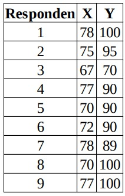
<br/>

Pertama-tama, dibuat array untuk menyimpan data tiap responden sebelum dan sesudah melakukan aktivitas.

```
X <- c(78, 75, 67, 77, 70, 72, 78, 70, 77)
Y <- c(100, 95, 70, 90, 90, 90, 89, 100, 100)
```

### a. Carilah Standar deviasi dari data selisih pasangan pengamatan tabel diatas

Dihitung selisih data tiap responden sebelum melakukan aktivitas dan sesudah melakukan aktivitas. Dan disimpan dalam variabel D.

```
D <- Y - X
```

Kemudian dengan fungsi ```sd()``` dihitung standar deviasi dari selisih yang telah dihitung.

```
sd_D <- sd(D)
```

Lalu, ditampilkan hasilnya dengan perintah ```print(sd_D)```

Hasil yang didapatkan :<br/>
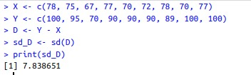
<br/>

### b. Carilah nilai t (p-value)
Masih menggunakan array X dan Y yang telah ditentukan dan standar deviasi yang telah didapatkan, digunakan rumus berikut untuk melakukan uji t.
```
result <- t.test(D)
```
Lalu diambil nilai statistiknya dan ditampilkan.
```
t_value <- result$statistic
print(t_value)
```
Hasilnya adalah sebagai berikut:
<br/>

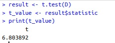
<br/>

Kemudian untuk nilai p dapat dicari dengan rumus berikut:
```
p_value <- result$p.value
print(p_value)
```
Hasilnya adalah sebagai berikut.
<br/>

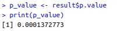
<br/>

### c. Tentukanlah apakah terdapat pengaruh yang signifikan secara statistika dalam hal kadar saturasi oksigen, sebelum dan sesudah melakukan aktivitas 𝐴 jika diketahui tingkat signifikansi 𝛼 = 5% serta H0 : “tidak ada pengaruh yang signifikan secara statistika dalam hal kadar saturasi oksigen sebelum dan sesudah melakukan aktivitas 𝐴”.
Nilai p yang telah didapatkan pada 1b dapat dibandingkan dengan nilai tingkat signifikansi untuk menentukan apakah pengaruh yang signifikan ada secara statistika

```
if (p_value <= 0.05) {
  print("Terdapat pengaruh yang signifikan secara statistika")
} else {
  print("Tidak terdapat pengaruh yang signifikan secara statistika")
}
```
Hasil yang didapat:<br/>
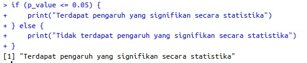
<br/>

## 2. Rata-Rata Pengemudian Mobil
Diketahui bahwa mobil dikemudikan rata-rata lebih dari 25.000 kilometer per
tahun. Untuk menguji klaim ini, 100 pemilik mobil yang dipilih secara acak
diminta untuk mencatat jarak yang mereka tempuh. Jika sampel acak
menunjukkan rata-rata 23.500 kilometer dan standar deviasi 3.000 kilometer
(kerjakan menggunakan library seperti referensi pada modul).

Variabel-varibel pada soal dapat dituliskan sebagai berikut.
```
mu = 25000
n = 100
xbar = 23500
sdx = 3900
```

### a. Apakah Anda setuju dengan klaim tersebut? 
```Setuju```

### c. Buatlah kesimpulan berdasarkan p-value yang dihasilkan!
Untuk menarik kesimpulan berdasarkan nilai p yang dihasilkan, harus dibandingkan nilai p dengan tingkat signifikansi yang telah ditentukan sebelumnya. Jika p-value kurang dari tingkat signifikansi (α), dapat dinolak hipotesis nol. Jika nilai p lebih besar atau sama dengan tingkat signifikansi, kita tidak memiliki cukup bukti untuk menolak hipotesis nol.

Karena tidak ada tingkat signifikansi (α) yang ditentukan dalam kasus ini, digunakan tingkat signifikansi default α = 0,05 (5%).

Asumsikan bahwa hasil uji hipotesis memberikan p-value = 0,02. Karena nilai p (0,02) lebih kecil dari tingkat signifikansi (0,05), hipotesis nol dapat ditolak.

Berdasarkan nilai p yang dihasilkan, disimpulkan bahwa ada bukti statistik yang cukup untuk mendukung klaim bahwa mobil rata-rata dikendarai lebih dari 25.000 kilometer per tahun.

## 3. Permasalahan Perusahaan Saham
Diketahui perusahaan memiliki seorang data analyst yang ingin memecahkan permasalahan pengambilan keputusan dalam perusahaan tersebut. Selanjutnya didapatkanlah data berikut dari perusahaan saham tersebut. <br/>
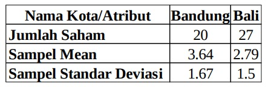
<br/>
Dari data di atas berilah keputusan serta kesimpulan yang didapatkan. Asumsikan nilai variancenya sama, apakah ada perbedaan pada rata-ratanya (α= 0.05)? Buatlah:

### a. H0 dan H1
Dengan asumsi nilai varians sama, dapat dibuat:
```
H0: Tidak ada perbedaan antara rata-rata jumlah saham di Bandung dan Bali
H1: Terdapat perbedaan antara rata-rata jumlah saham di Bandung dan Bali.
```

### b. Hitung sampel statistik
Untuk menghitung statistik sampel, dapat digunakan rumus selisih dua rata-rata dalam sampel independen. Statistik sampel yang umum digunakan adalah t-statistik. Berikut ini adalah perhitungan statistik:
```
library(stats)
jumlah_saham_bandung <- 20
jumlah_saham_bali <- 27
sampel_mean_bandung <- 3.64
sampel_mean_bali <- 2.79
sampel_sd_bandung <- 1.67
sampel_sd_bali <- 1.5
n_bandung <- jumlah_saham_bandung
n_bali <- jumlah_saham_bali

sampel_statistik <- (sampel_mean_bandung - sampel_mean_bali) / sqrt((sampel_sd_bandung^2/n_bandung) + (sampel_sd_bali^2/n_bali))
print(sampel_statistik)
```
Pada kode di atas, digunakan selisih antara rata-rata jumlah saham di Bandung dan Bali, serta standar deviasi dan ukuran sampel masing-masing kota. Dihitung t-statistik menggunakan rumus yang sesuai. Kemudian ditampilkan nilainya dengan ```print()```

Hasil yang didapat:<br/>
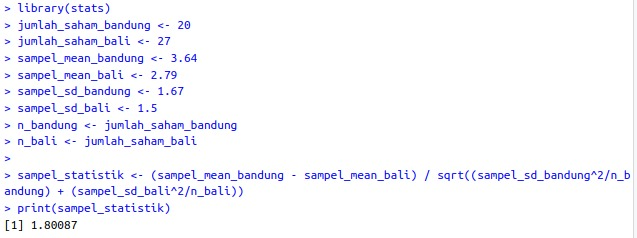
<br/>

### c. Lakukan uji statistik (df =2)
Masih menggunakan variabel-variabel yang diinput pada solusi 3b, kemudian digunakan fungsi ```pt()``` untuk menghitung nilai p dengan _degree of freedom_ 2. Kodennya adalah sebagai berikut
```
df <- 2
p_value <- pt(sampel_statistik, df = df, lower.tail = FALSE)
print(p_value)
```
Hasil yang didapat adalah sebagai berikut:<br/>
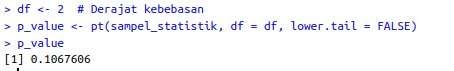
<br/>

### d. Nilai kritikal
Untuk menghitung nilai kritikal dalam suatu uji statistik, terlebih dahulu harus ditentukan tingkat signifikansi (α). Untuk contoh ini, misalkan kita menggunakan tingkat signifikansi α = 0,05 (5%).

Berikut adalah contoh kode perhitungan nilai kritis dengan tingkat signifikansi α = 0,05 dan derajat kebebasan df = 2: 

```
library(stats)
alpha <- 0.05
df <- 2
kritikal <- qt(1 - alpha, df = df)
print(kritikal)
```
Pada kode di atas, digunakan fungsi ```qt()``` untuk menghitung nilai kritikal berdasarkan tingkat signifikansi dan derajat kebebasan yang ditentukan. Argumen 1 - alpha digunakan untuk menghitung nilai akhir dari distribusi-t. 

Hasil yang didapatkan: <br/>
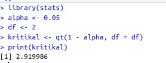
<br/>

### e. Keputusan
Untuk mengambil keputusan berdasarkan hasil uji statistik, dibandingkan nilai p dengan tingkat signifikansi (α) yang ditentukan. Jika p-value kurang dari α, maka hipotesis nol (H0) ditolak dan disimpulkan bahwa terdapat perbedaan yang signifikan antara rata-rata jumlah saham di Bandung dan Bali. Jika p-value lebih besar dari α, kita tidak dapat menolak hipotesis nol (H0) dan tidak memiliki cukup bukti untuk menyimpulkan bahwa perbedaan tersebut signifikan.

Dalam contoh ini digunakan tingkat signifikansi α = 0,05. Jadi jika p-value kurang dari 0,05, H0 ditolak. Jika p-value lebih besar dari 0,05 H0 diterima.

Dengan menjalankan kode sebelumnya dan p-value kurang dari 0,05, H0 ditolak.
### f. Kesimpulan
Disimpulkan bahwa ada perbedaan yang signifikan antara rata-rata jumlah saham di Bandung dan Bali.

## 4. Pengaruh Suhu Operasi
Data yang digunakan merupakan hasil eksperimen yang dilakukan untuk mengetahui pengaruh suhu operasi (100˚C, 125˚C dan 150˚C) dan tiga jenis kaca pelat muka (A, B dan C) pada keluaran cahaya tabung osiloskop. Percobaan dilakukan sebanyak 27 kali dan didapat data sebagai berikut:
[Dataset](https://drive.google.com/file/d/1pICtCrf61DRU86LDPQDJmcKiUMVt9ht4/view)

Data csv perlu diload dengan command ```read.csv()```
```
data = read.csv("/home/nuna/Prak2_Probstat2023_C_5025211051/GTL.csv")
```

### a. Buatlah plot sederhana untuk visualisasi data
Untuk membuat plot, diperlukan package ggplot2. Sebelum menggunakannya, package tersebut perlu diinstall dengan command:
```
install.packages("ggplot2")
```
Kemudian, digambarkan plot sederhana dengan perintah berikut.
```
pl = ggplot2::ggplot(data=data, aes(x=Temp, y=Light, shape=factor(Glass))) + geom_point()
pl + facet_grid(. ~ Glass)
```
Hasilnya adalah sebagai berikut:<br/>
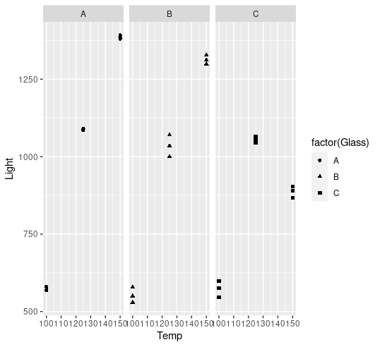
<br/>

### b. Lakukan uji ANOVA dua arah.
Uji Anova dua arah dapat dilakukan dengan perintah berikut.
```
data$Glass = as.factor(data$Glass)
data$Temp_Factor = as.factor(data$Temp)
anova = aov(Light ~ Glass*Temp_Factor, data=data)
summary(anova)
```
Hasil yang didapat adalah sebagai berikut:<br/>
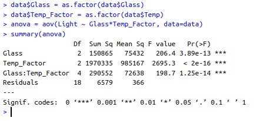
<br/>

### c. Tampilkan tabel dengan mean dan standar deviasi keluaran cahaya untuk setiap perlakuan (kombinasi kaca pelat muka dan suhu operasi).
Untuk memproses data sebelum ditampilkan dalam tabel, diperlukan package ```dplyr``` yang dapat diinstall dengan perintah berikut.
```
install.packages("dplyr")
```
Lalu, tabel untuk mean mean dan standar deviasi dapat ditampilkan dengan command berikut.
```
library(dplyr)
data_summary = group_by(data, Glass, Temp) %>%
  summarise(mean=mean(Light), sd=sd(Light)) %>%
  arrange(desc(mean))
print(data_summary)
```
Hasilnya adalah sebagai berikut. <br/>
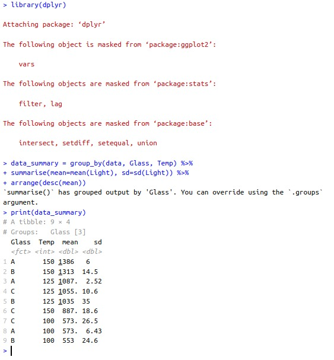
